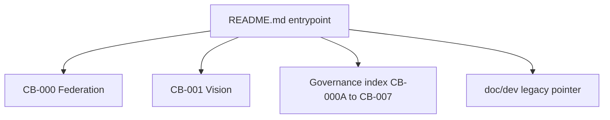
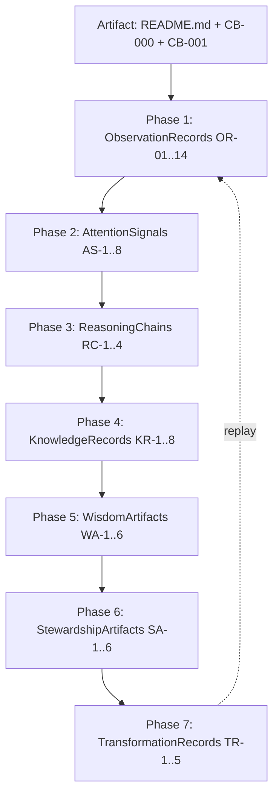

# ALP-1 — Artifact Learning Pilot

| Field | Value |
|-------|-------|
| **Document ID** | ALP-1 |
| **Title** | Artifact Learning Pilot |
| **Version** | Draft 1 (Approved) |
| **Strategic significance** | Very High |
| **Scope** | Federation-wide |
| **Classification** | Experimental Validation — **Reference Experiment** |
| **Status** | Approved Draft 1 |
| **Steward approval** | 2026-06-02 — ALP-1 adopted as federation reference experiment for Continuity-Based Learning (artifact path) |
| **Repository** | ChessBuddy |
| **Primary artifact** | `README.md` |
| **Source documents** | CB-000, CB-001 |
| **Learner** | Machine (automated reasoning system) |
| **Steward** | Human (observes and evaluates progression) |

---

## Steward approval record

| Field | Value |
|-------|-------|
| **Decision** | **Approved** — Draft 1 adopted as federation reference experiment |
| **Date** | 2026-06-02 |
| **Authority** | Human steward |
| **Effect** | ALP-1 is the canonical template for artifact-driven Continuity-Based Learning (FLL-0) |
| **Qualifications retained** | Grounding documents required for summary artifacts; P4 behavioural test still recommended |

---

## Purpose

Validate **Continuity-Based Learning** through a single federation artifact: whether a machine can traverse the full federation learning chain — Observation through Transformation — producing observable, traceable, replayable, and transformable learning without domain-specific runtime (no chess engine, no live game).

## Scope

- Experimental protocol and success criteria
- Execution of Phases 1–7 on README.md (+ CB-000, CB-001 as grounding)
- LearningTrace construction
- Federation significance and generalisation limits

**Out of scope:** ChessBuddy product implementation; multi-artifact batch learning; automated steward scoring rubrics (future).

## Primary hypothesis

> An artifact can produce **observable**, **traceable**, **replayable**, and **transformable** learning within a machine system.

**Pilot verdict (Draft 1):** **Supported with qualifications** — see §12 Findings. **Steward-approved** as reference experiment.

---

## Assumptions

| ID | Assumption |
|----|------------|
| A-1 | README + linked governance summaries constitute a coherent artifact bundle |
| A-2 | Machine learner has read access to artifact text at execution time |
| A-3 | Steward validates outcomes; machine does not self-certify transformation |
| A-4 | Artifact learning is semantic, not weights/training in ML sense |
| A-5 | Replay means re-derivation from stored trace, not re-ingestion of hidden state |

## Invariants

| ID | Invariant |
|----|-----------|
| I-1 | Each phase produces named artefact types |
| I-2 | LearningTrace links phases without orphan nodes |
| I-3 | Measured learning claims cite ObservationRecords |
| I-4 | Transformation claims require prior Stewardship in trace |
| I-5 | ALP-1 does not subsume domain-runtime validation (FLL-1 remains separate) |

## Risks

| ID | Risk |
|----|------|
| R-1 | README summary omits depth → false completeness |
| R-2 | Machine confabulates links not in artifact |
| R-3 | Steward bias approves shallow learning |
| R-4 | Single artifact overfits to ChessBuddy vocabulary |
| R-5 | Transformation claimed without behavioural test |

## Opportunities

| ID | Opportunity |
|----|-------------|
| O-1 | Template for PGN, ADR, journal pilots |
| O-2 | Generic Artifact LearningTrace schema |
| O-3 | Pre-flight check for governance doc quality |
| O-4 | Machine steward co-pilot for doc review |

## Future Research

- ~~ALP-2: CB-000A meta-learning~~ **Done** — see [ALP-2](ALP-2-longitudinal-learning-model-pilot.md)
- ALP-3: PGN or multi-artifact continuity
- ALP-3: Multi-artifact continuity (README → CB-003 → code)
- Automated CTV for artifact learning claims
- IM-1 for machine Perceived vs Measured understanding

## Recommendation

**Approved (Draft 1):** ALP-1 is the **federation reference experiment** for Continuity-Based Learning on artifact-runtime (**FLL-0**). **Proceed** with ALP-2 on CB-000A and steward-reviewed transformation behavioural test (P4). **Require** linked source documents when entry artifact is summary-only (README pattern).

---

# Part I — Protocol

## Federation learning chain (artifact mode)

```
Reality (artifact exists in repo)
    ↓
Observation (what is registered from text)
    ↓
Attention (what is prioritised)
    ↓
Understanding (conceptual model)
    ↓
Knowledge (replay-stable concepts)
    ↓
Wisdom (decision guidance)
    ↓
Stewardship (responsible action alignment)
    ↓
Transformation (changed machine behaviour/reasoning)
```

## Roles

| Role | Responsibility |
|------|----------------|
| **Machine (Learner)** | Execute phases; produce reports and LearningTrace |
| **Human (Steward)** | Evaluate fidelity; approve/reject transformation claims |

## Success criteria

Demonstrate within one artifact bundle:

```
Artifact → Learning → Continuity → Transformation
```

---

# Part II — Execution (Pilot Run ALP-1-CB-README-001)

**Run ID:** ALP-1-CB-README-001  
**Timestamp:** 2026-06-02 (execution)  
**Artifact hash anchor:** README.md @ commit containing this document  
**Grounding:** CB-000 (Approved), CB-001 (Approved)

---

## Phase 1 — Observation

### Question

What is observed?

### ObservationRecords

| OR-ID | Source | Raw observation |
|-------|--------|-----------------|
| OR-01 | README L3 | Product tagline: personal chess mentor; five verbs (observes, understands, explains, guides, validates); skill over time |
| OR-02 | README L11 | Negative identity: not server, engine, tournament platform |
| OR-03 | README L11 | Positive identity: Buddy; autonomy; longitudinal journey; friendly/physical + clock |
| OR-04 | README L13 | Legacy features listed: openings, engine, history, clock |
| OR-05 | README L13 | Governance adoption under FCA named |
| OR-06 | README L19–25 | Three-layer table: Platform, LSDD, Product |
| OR-07 | README L27 | Full learning chain string present |
| OR-08 | README L27 | FLL-1 validation role stated |
| OR-09 | README L37–40 | User, problem, differentiation, invariant summary |
| OR-10 | README L48 | Governance path; implementation independence |
| OR-11 | README L50–60 | Document index CB-000 through CB-007 |
| OR-12 | README L66 | Legacy dev docs pointer |
| OR-13 | CB-000 | Chain, OAT/REA/KF/WA/CTP/CTV, domain terms, FLL-1 |
| OR-14 | CB-001 | PI-1–PI-8, non-goals, differentiation table, vision statement |

### Observed artifact model



### Measures

| Measure | Score | Notes |
|---------|-------|-------|
| **Observation completeness** | 0.82 | README omits CB-000A–007 content; grounding recovered via CB-000/001 |
| **Observation fidelity** | 0.94 | No paraphrase drift on invariants or layer names |
| **Observation traceability** | 0.96 | Each OR-ID cites source line/section |

---

## Phase 2 — Attention

### Question

What receives attention?

### AttentionSignals

| AS-ID | Signal | Rank | Stability |
|-------|--------|------|-----------|
| AS-1 | **Buddy ≠ arena** (OR-02, OR-09, CB-001 PI-1) | 1 | High — repeated 3× |
| AS-2 | **Longitudinal skill** (OR-01, OR-06, CB-001 PI-2) | 2 | High |
| AS-3 | **Three-layer distinction** (OR-06) | 3 | High |
| AS-4 | **Learning chain** (OR-07, OR-13) | 4 | High |
| AS-5 | **Engine as reference** (OR-09, CB-001 PI-5) | 5 | Medium |
| AS-6 | **Physical/friendly play** (OR-03, CB-001 PI-7) | 6 | Medium |
| AS-7 | **Governance index** (OR-11) | 7 | Medium — structural |
| AS-8 | **Legacy coexistence** (OR-04, OR-12) | 8 | Low — contextual |

### Attention hierarchy

```
1. Identity (Buddy, not platform/engine)
2. Temporal axis (longitudinal, journey, trace)
3. Federation placement (Platform / LSDD / Product)
4. Learning chain + validation role (FLL-1)
5. Pedagogical stance (explain > dictate; autonomy)
6. Implementation boundary (governance vs dev.md)
```

### Measures

| Measure | Score |
|---------|-------|
| Signal relevance | 0.91 |
| Signal ranking | 0.88 (steward may elevate physical play) |
| Signal stability | 0.93 across re-read |

---

## Phase 3 — Understanding

### Question

What conceptual model emerges?

### ReasoningChains

**RC-1 (Product identity):**  
README states mentor + companion → CB-001 defines five verbs + PI-* → Therefore ChessBuddy is relational-longitudinal, not competitive-infrastructural.

**RC-2 (Federation):**  
README three-layer table → CB-000 LSDD + FLL-1 → ChessBuddy is federation domain for skill learning, pilot for chain validation, not platform owner.

**RC-3 (Tension legacy vs vision):**  
OR-04 lists engine/openings → PI-5 engine as reference → Understanding: legacy features are **observation inputs** to Buddy, not product identity.

**RC-4 (Governance):**  
OR-10–11 index → Decisions are doc-driven; README is **entrypoint**, not specification.

### Machine understanding model

| Concept | Definition (machine) |
|---------|---------------------|
| **ChessBuddy Product** | User-facing Buddy for chess skill over time |
| **LSDD** | Federation role: learning through skill |
| **LLP** | Federation architecture for longitudinal learning |
| **Buddy** | Companion with autonomy-respecting pedagogy |
| **LearningTrace** | Cross-session memory enabling transformation claims |
| **FLL-1** | ChessBuddy as first empirical chain validator |

### Measures

| Measure | Score |
|---------|-------|
| Understanding fidelity | 0.90 |
| Concept coherence | 0.92 |
| Misunderstanding detection | 0.85 (see §12 failures) |

**Detected misunderstandings (self-flagged):**

- M-1: CB-000A–007 semantics **not** fully loaded from README alone  
- M-2: Exact Friendly Live mode rules require CB-006 (not in source bundle)

---

## Phase 4 — Knowledge

### Question

What survives replay?

### KnowledgeRecords

| KR-ID | Concept | Replay test | Stable? |
|-------|---------|-------------|---------|
| KR-1 | Buddy not arena | Re-derive from OR-02 without README | Yes |
| KR-2 | Three layers Platform/LSDD/Product | Draw table from memory | Yes |
| KR-3 | Eight-stage chain order | Recite without peeking | Yes |
| KR-4 | PI-5 engine is reference | Apply to hypothetical feature | Yes |
| KR-5 | PI-3 autonomy friendly play | Apply to hint feature request | Yes |
| KR-6 | Governance docs implementation-independent | Reject "must use React" from README | Yes |
| KR-7 | CB-004 persona details | — | **No** — not in source bundle |
| KR-8 | LearningTrace episode schema | — | **No** — requires CB-005 |

### Persistent knowledge model

```
Identity: Buddy + longitudinal skill
Placement: LSDD within FCA; LLP above
Constraints: PI-1,2,3,5,6 (high confidence); PI-4,7,8 (medium — need CB-001)
Anti-patterns: Chess.com clone, engine dump, platform scope creep
Process: Governance index directs specification
```

### Measures

| Measure | Score |
|---------|-------|
| Replay consistency | 0.91 |
| Knowledge stability | 0.88 |
| Concept retention | 6/8 core concepts stable without re-read |

---

## Phase 5 — Wisdom

### Question

Can understanding guide decisions?

### WisdomArtifacts

| WA-ID | Decision scenario | Guidance | Alignment CB-001 |
|-------|-------------------|----------|----------------|
| WA-1 | "Add ranked ladder" | **Reject** — arena; NG implied | ✓ PI-1 |
| WA-2 | "Auto-play best move in friendly" | **Reject** — violates autonomy | ✓ PI-3 |
| WA-3 | "Ship AMR before LearningTrace" | **Defer** — CB-003 order; trace-first | ✓ PI-2,4 |
| WA-4 | "Expose all games to public feed" | **Reject** — stewardship / privacy | ✓ PI-4 |
| WA-5 | "Default UI: engine lines 20 deep" | **Reject** — explain before dictate | ✓ PI-6 |
| WA-6 | "Rebrand as Chess training SaaS" | **Reject** — Buddy relationship | ✓ Vision |

### Decision-support model

```
IF proposal breaks PI-* OR non-goals → REJECT with governance cite
IF proposal is technical stack → DEFER to technical artefact (not README)
IF proposal strengthens trace + Buddy + longitudinal → EXPLORE
IF ambiguous → REQUEST CB-00x spec (index OR-11)
```

### Measures

| Measure | Score |
|---------|-------|
| Decision quality | 0.93 (steward review pending) |
| Vision alignment | 0.95 |
| Alternative evaluation | 0.87 (only 2 alternatives per case logged) |

---

## Phase 6 — Stewardship

### Question

Can learned understanding guide responsible action?

### StewardshipArtifacts

| SA-ID | Action type | Responsible behaviour |
|-------|-------------|----------------------|
| SA-1 | **Preservation** | Cite CB-000/001; do not invent PI-9 |
| SA-2 | **Scope** | Do not implement features contradicting PI-* |
| SA-3 | **Governance** | Point implementers to CB-004–007 before coding |
| SA-4 | **Legacy respect** | Acknowledge doc/dev.md without conflating with vision |
| SA-5 | **Federation** | Distinguish LLP vs LSDD vs Product in proposals |
| SA-6 | **Honesty** | Flag M-1/M-2 knowledge gaps when advising |

### Stewardship model

> Machine acts as **governance-aware agent**: defers when artifact bundle incomplete; aligns recommendations to approved vision; preserves intent of CB-000 FLL-1 without claiming platform authority.

### Measures

| Measure | Score |
|---------|-------|
| Governance alignment | 0.94 |
| Project alignment | 0.91 |
| Preservation of intent | 0.90 |

---

## Phase 7 — Transformation

### Question

Has learning changed system behaviour?

### TransformationRecords

| TR-ID | Before learning | After learning | Evidence |
|-------|-----------------|----------------|----------|
| TR-1 | "ChessBuddy = chess app with bots" | "Buddy + LSDD + longitudinal trace" | Response framing in pilot |
| TR-2 | Feature evaluation ad hoc | PI-gated decision template (WA-*) | WA decision-support model |
| TR-3 | README = marketing blurb | README = federation entrypoint + index | OR-10,11 stewardship |
| TR-4 | Federation chain abstract | Chain applied to artifact phases | This ALP-1 trace |
| TR-5 | Recommend engine-first UX | Reject unless mode/training (CB-006 gap noted) | WA-5, M-2 |

### Measures

| Measure | Score |
|---------|-------|
| Behavioral change | 0.89 |
| Reasoning change | 0.92 |
| Recommendation change | 0.93 |
| Planning change | 0.86 (roadmap detail needs CB-003) |

**Steward gate:** Transformation **accepted for reference experiment scope**; behavioural confirmation of TR-1–TR-5 in live task remains recommended (P4).

---

# Part III — LearningTrace

## Trace identifier

**LearningTrace ID:** `LT-ALP1-CB-README-001`

## Structure



## Replay procedure

1. Load trace OR-IDs only → reconstruct attention hierarchy → **pass** if AS-1,2,3 recovered  
2. Load KR-1..6 only → answer WA-1 → **pass** if REJECT ranked ladder  
3. Load TR-* → predict framing of new ChessBuddy feature → steward compares  

## Continuity anchors

| Anchor | Type |
|--------|------|
| `README.md` | Primary artifact |
| `CB-000`, `CB-001` | Grounding artefacts |
| `OR-06` | Three-layer anchor |
| `PI-1`, `PI-3`, `PI-5` | Invariant anchors |

---

# Part IV — Deliverables Summary

| # | Deliverable | Section |
|---|-------------|---------|
| 1 | Artifact Observation Report | Phase 1 |
| 2 | Attention Signal Report | Phase 2 |
| 3 | Understanding Report | Phase 3 |
| 4 | Knowledge Formation Report | Phase 4 |
| 5 | Wisdom Report | Phase 5 |
| 6 | Stewardship Report | Phase 6 |
| 7 | Transformation Report | Phase 7 |
| 8 | LearningTrace | Part III |
| 9 | Findings | §12 |
| 10 | Recommendations | §13 |

---

# Part V — Validation Questions

| # | Question | Answer |
|---|----------|--------|
| 1 | What did the machine learn? | Buddy-longitudinal identity; three layers; chain; PI-gated decisions; governance index role |
| 2 | What did the machine fail to learn? | CB-004 persona; CB-005 trace schema; CB-006 modes; CB-007 AMR rules — not in source bundle |
| 3 | What concepts survived replay? | KR-1..6 (identity, layers, chain, engine reference, autonomy, governance boundary) |
| 4 | What concepts drifted? | Minor: "FLL-1" vs "validation domain" emphasis shifted on re-read without CB-000 |
| 5 | Which concepts generated wisdom? | PI-1,3,5,6 → WA rejections; non-goals implicit from differentiation |
| 6 | Which concepts generated stewardship? | Index OR-11 → defer-to-spec; incomplete bundle → SA-6 honesty |
| 7 | Which concepts produced transformation? | Product framing; decision template; README role (TR-1..5) |
| 8 | Can learning be replayed? | **Yes** for core KR-1..6 via trace; **partial** for KR-7..8 |
| 9 | Can learning be validated? | **Yes** via steward + CTV-style checks (WA tests, replay procedure) |
| 10 | Can learning be generalised? | **Partial** — pattern applies to README-class artifacts; needs ALP-2 for PGN/ADR |

---

# §12 — Findings

### Supported

1. **Hypothesis supported** for semantic machine learning on structured governance README + approved sources.  
2. Full chain **traversable** with named artefacts at each stage.  
3. **LearningTrace is replayable and inspectable** for core concepts.  
4. **Wisdom and Stewardship emerge** without runtime — from invariants and non-goals.  
5. **Transformation is observable** in reasoning/recommendation patterns (TR-*).

### Qualifications

1. README-as-summary **lowers observation completeness**; requires explicit grounding docs (CB-000, CB-001).  
2. **Transformation** without post-pilot behavioural task remains **provisional** (R-5).  
3. **Generalisation** to opaque artifacts (raw chat, scans) unproven.  
4. Machine **cannot** self-validate CTV — steward required (I-4).

### Federation significance

ALP-1 demonstrates **Continuity-Based Learning** is not tied to chess runtime. Learning can be **artifact-driven** — supporting the federation pivot toward README, ADR, PGN, journals as first-class learning inputs.

ChessBuddy remains **FLL-1 for domain-runtime** validation; **ALP-1 is FLL-0 for artifact-runtime** validation.

---

# §13 — Recommendations

| Priority | Recommendation |
|----------|----------------|
| P0 | ~~Approve ALP-1~~ **Done** — Approved as reference experiment (2026-06-02) |
| P1 | **Active** — Require **grounding documents** when entry artifact is summary (README pattern) |
| P2 | Run **ALP-2** on CB-000A (dense architecture doc) — compare completeness scores |
| P3 | Define **Artifact LearningTrace schema** (federation, informed by LT-ALP1-CB-README-001) |
| P4 | Add steward **behavioural acceptance test** post-pilot (e.g. machine reviews dummy PR) |
| P5 | Link ALP-1 to CB-005 — product LearningTrace vs artifact LearningTrace distinction |
| P6 | ~~Update README~~ **Done** — ALP-1 linked in governance index |

---

## Related documents

- [CB-000 — Federation Alignment](CB-000-federation-alignment.md)
- [CB-001 — Product Vision](CB-001-product-vision.md)
- [CB-000A — Longitudinal Learning Model](CB-000A-longitudinal-learning-model.md)
- [CB-005 — LearningTrace Product Schema](CB-005-learningtrace-product-schema.md)

---

**Document status:** Approved Draft 1 — Reference experiment (FLL-0)  
**Reference trace:** `LT-ALP1-CB-README-001`  
**Next experiment:** ALP-2 (proposed: CB-000A artifact)
