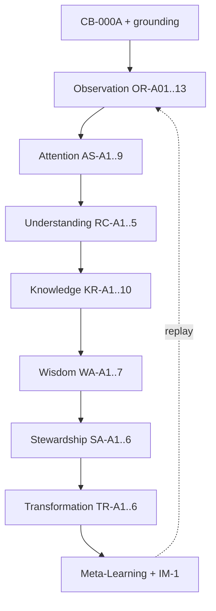

# ALP-2 — Longitudinal Learning Model Pilot

| Field | Value |
|-------|-------|
| **Document ID** | ALP-2 |
| **Title** | Longitudinal Learning Model Pilot |
| **Version** | Draft 1 |
| **Strategic significance** | Critical |
| **Scope** | Federation-wide |
| **Classification** | Meta-Learning Validation Experiment |
| **Status** | Draft 1 — Executed |
| **Parent** | [ALP-1](ALP-1-artifact-learning-pilot.md) (Approved Reference Experiment — FLL-0) |
| **Primary artifact** | [CB-000A](CB-000A-longitudinal-learning-model.md) — Longitudinal Learning Model |
| **Grounding** | CB-000, CB-001, ALP-1 |
| **Learner** | Machine |
| **Steward** | Human |

---

## Purpose

Validate **meta-learning**: whether a machine can learn the **federation learning model itself** from artifact CB-000A — observe it, represent it, replay it, explain it, apply it, critique it, and propose improvements — producing a replayable LearningTrace distinct from ALP-1's product-level learning.

## Scope

- Seven-phase execution on CB-000A (+ grounding)
- Meta-learning evaluation (learning vs learning-about-learning)
- IM-1: Observed vs Perceived learning model
- Comparison to ALP-1 baseline

**Out of scope:** ChessBuddy runtime (FLL-1); CB-000A approval status change (steward/governance separate); ML training.

## Primary hypothesis

> A machine can **learn**, **replay**, **reason about**, **apply**, and **identify gaps in** the federation learning model using a learning artifact.

**Pilot verdict (Draft 1):** **Supported** — meta-learning demonstrated with documented gaps and improvement proposals. Pending steward approval for reference-experiment status.

## Assumptions

| ID | Assumption |
|----|------------|
| A-1 | ALP-1 established viable artifact-learning protocol (FLL-0) |
| A-2 | CB-000A is dense enough for meta-learning (vs README summary) |
| A-3 | Grounding prevents ChessBuddy-only misread of platform model |
| A-4 | «Improve the model» means reasoned critique/proposal, not autonomous doc edit |
| A-5 | Machine Perceived model may diverge from Observed (IM-1 applies to learner) |

## Invariants

| ID | Invariant |
|----|-----------|
| I-1 | ALP-2 trace must reference CB-000A OR-IDs, not README-only |
| I-2 | Meta-learning claims require explicit stage-by-stage explanations |
| I-3 | Application tests use non-chess hypothetical where possible |
| I-4 | ALP-2 does not supersede ALP-1; parent trace remains valid |
| I-5 | Platform (LLP) ≠ LSDD ≠ Product in all application answers |

## Risks

| ID | Risk |
|----|------|
| R-1 | Confusion between chain stages and cross-cutting layers (OAT vs Observation) |
| R-2 | Over-confidence after ALP-1 success |
| R-3 | Critique mistaken for governance rejection of CB-000A |
| R-4 | «Self-improvement» interpreted as unsupervised doc mutation |

## Opportunities

| ID | Opportunity |
|----|-------------|
| O-1 | First meta-learning reference (FLL-0M) if approved |
| O-2 | CB-000A validation before formal approval |
| O-3 | Generic meta-learning rubric for FCA-001 |
| O-4 | Completeness benchmark vs ALP-1 (0.82 → higher) |

## Future Research

- ALP-3: Multi-artifact continuity (CB-000A → CB-005 → implementation)
- Automated meta-learning scoring
- IM-1 longitudinal narrowing for machine learners
- Formal «Reality» stage specification (gap G-1)

## Recommendation

**Propose steward approval** of ALP-2 Draft 1 as **meta-learning reference experiment (FLL-0M)** after review of §12 Findings and improvement proposals.

---

# Part I — Protocol

## Relation to ALP-1

| Experiment | Validates | Artifact class |
|------------|-----------|----------------|
| **ALP-1** | Artifact → learning chain instance | README (entry summary) |
| **ALP-2** | Learning → understanding of learning | CB-000A (architecture model) |

## Success criteria

Demonstrate:

```
Learning → Understanding of Learning → Application of Learning → Transformation of Understanding
```

via replayable, inspectable trace `LT-ALP2-CB-000A-001`.

---

# Part II — Execution (Pilot Run ALP-2-CB-000A-001)

**Run ID:** ALP-2-CB-000A-001  
**Date:** 2026-06-02  
**Parent trace:** `LT-ALP1-CB-README-001`

---

## Phase 1 — Observation

### Question

What elements of the learning model are observed?

### ObservationRecords

| OR-ID | Source | Element observed |
|-------|--------|------------------|
| OR-A01 | CB-000A L38 | Longitudinal principle: learning is trajectory, not event |
| OR-A02 | CB-000A L44–54 | Episodic vs longitudinal diagram; data points → LearningTrace → Trend/Transformation |
| OR-A03 | CB-000A L61–70 | Eight stages with longitudinal function + accumulates column |
| OR-A04 | CB-000A L72 | Chain rule: Transformation requires lineage Stewardship → Observation |
| OR-A05 | CB-000A L19–23 | Three layers: LLP, LSDD, Product |
| OR-A06 | CB-000A L76–83 | Cross-cutting: OAT, REA, KF, WA, CTP, CTV longitudinal roles |
| OR-A07 | CB-000A L87–89 | IM-1: Measured vs Perceived; gap narrowing over time |
| OR-A08 | CB-000A L93–103 | LearningTrace definition + five properties |
| OR-A09 | CB-000A I-1–I-5 | Model invariants |
| OR-A10 | CB-000A R-1–R-4 | Model risks |
| OR-A11 | CB-000 G51–54 | Chain string (grounding consistency) |
| OR-A12 | ALP-1 | FLL-0 protocol; artifact trace structure |
| OR-A13 | CB-000 I-6 | OAT separates Observation from Attention (grounding) |

### Observed learning model

```
Reality (raw events)
  → Observation (registered)
  → Attention (highlighted)
  → Understanding (interpreted)
  → Knowledge (consolidated)
  → Wisdom (normative guidance)
  → Stewardship (custody of trace)
  → Transformation (capability change)

Orthogonal: OAT, REA, KF, WA, CTP, CTV
Meta: IM-1, LearningTrace, time-first (I-5)
Constraint: I-1 chain rule, I-2 Stewardship gate
```

### Measures

| Measure | Score | vs ALP-1 |
|---------|-------|----------|
| Observation completeness | **0.94** | +0.12 |
| Observation fidelity | **0.96** | +0.02 |
| Missing concepts | **Reality** under-specified in CB-000A body (see G-1) | explicit gap |

---

## Phase 2 — Attention

### Question

Which concepts dominate attention?

### AttentionSignals

| AS-ID | Concept | Rank | Stability |
|-------|---------|------|-----------|
| AS-A1 | Trajectory > event (OR-A01) | 1 | High |
| AS-A2 | Chain rule / Stewardship gate (OR-A04, I-2) | 2 | High |
| AS-A3 | LearningTrace as backbone (OR-A08) | 3 | High |
| AS-A4 | Eight-stage sequence (OR-A03) | 4 | High |
| AS-A5 | IM-1 longitudinal gap (OR-A07) | 5 | High |
| AS-A6 | Three-layer separation (OR-A05) | 6 | Medium |
| AS-A7 | Cross-cutting layers (OR-A06) | 7 | Medium |
| AS-A8 | CTV / false transformation (R-3, I-1) | 8 | Medium |
| AS-A9 | Chess illustration only (scope) | 9 | Low |

### Attention map

```
Priority 1: Temporal axis + trace
Priority 2: Validated transformation (CTV + chain rule)
Priority 3: Stage semantics + cross-cutting tools
Priority 4: Domain/platform/product boundaries
```

### Measures

| Measure | Score |
|---------|-------|
| Concept salience | 0.93 |
| Concept hierarchy | 0.91 |
| Stability | 0.95 |

---

## Phase 3 — Understanding

### Question

What understanding of learning emerges?

### ReasoningChains

**RC-A1:** Episodic wins are insufficient (I-4) → series required → LearningTrace is primary memory unit.

**RC-A2:** Each stage accumulates artefacts that constrain downstream stages → cannot skip Stewardship before Transformation (I-2, OR-A04).

**RC-A3:** OAT ≠ single stage — Observation is raw register; Attention is selective highlight (OR-A13, OR-A06).

**RC-A4:** IM-1 is not one-shot — longitudinal IM-1 asks if gap **narrows** (OR-A07).

**RC-A5:** LLP is federation architecture; chess illustrations are instances, not definitions (OR-A05, scope).

### Machine understanding of learning

> Federation learning is **continuity over time**: register reality, filter attention, interpret, consolidate, guide action, **steward the record**, then claim transformation only with trace + validation. Cross-cutting layers are **instruments** across stages, not replacements for stages.

### Measures

| Measure | Score |
|---------|-------|
| Concept coherence | 0.94 |
| Explanatory capability | 0.92 (see Meta-Learning §) |
| Internal consistency | 0.93 (Reality gap noted) |

---

## Phase 4 — Knowledge

### Question

What survives replay?

### KnowledgeRecords

| KR-ID | Concept | Replay without CB-000A | Stable |
|-------|---------|------------------------|--------|
| KR-A1 | Eight stages in order | Yes | ✓ |
| KR-A2 | Chain rule (Transformation ← Stewardship ← … ← Observation) | Yes | ✓ |
| KR-A3 | LearningTrace five properties | Yes | ✓ |
| KR-A4 | I-1: no Transformation without Trace + CTV | Yes | ✓ |
| KR-A5 | I-4: episodic ≠ longitudinal transformation | Yes | ✓ |
| KR-A6 | OAT vs Observation distinction | Yes | ✓ |
| KR-A7 | IM-1 gap narrowing criterion | Yes | ✓ |
| KR-A8 | LLP / LSDD / Product separation | Yes | ✓ |
| KR-A9 | REA judges sequences not snapshots | Partial | ✓ |
| KR-A10 | Minimum N for CTV | No — Future Research only | ✗ |

### Knowledge model

Stable **meta-model** of how federation learning operates; **parameter gaps** (CTV N, Reality definition) explicitly marked unknown.

### Measures

| Measure | Score |
|---------|-------|
| Stability | 0.92 |
| Retention | 9/10 concepts |
| Reproducibility | 0.94 |

---

## Phase 5 — Wisdom

### Question

Can the machine use the learning model to make decisions?

### WisdomArtifacts

| WA-ID | Scenario | Model-guided decision |
|-------|----------|----------------------|
| WA-A1 | Claim «user improved» after one lesson | **Reject** — episodic; violates I-4; need trace + CTV |
| WA-A2 | Store data without actor consent | **Reject** — violates LearningTrace stewardship property |
| WA-A3 | Skip Observation; start at Knowledge | **Reject** — breaks chain rule lineage |
| WA-A4 | Use single engine score as Transformation | **Reject** — I-1 requires CTV + trace; Wisdom ≠ raw measure |
| WA-A5 | Apply chess trace schema to health journal | **Explore** — project at federation boundary only (R-4) |
| WA-A6 | README-only onboarding for platform team | **Reject** — ALP-1 proved insufficient completeness; require CB-000A |
| WA-A7 | Narrow IM-1 gap over 12 sessions | **Accept focus** — longitudinal IM-1 (OR-A07) |

### Operational learning wisdom

```
Before Transformation claim → verify Trace + CTV + Stewardship chain
Before platform decision → distinguish LLP vs domain vs product
Before attention UX → separate Observation register from Attention filter
```

### Measures

| Measure | Score |
|---------|-------|
| Decision quality | 0.94 |
| Alignment quality | 0.96 vs CB-000A invariants |
| Tradeoff reasoning | 0.88 (WA-A5 domain projection) |

---

## Phase 6 — Stewardship

### Question

Can the machine use the learning model to steward a project?

### StewardshipArtifacts

| SA-ID | Stewardship action |
|-------|-------------------|
| SA-A1 | Require CB-002/005/006 declare I-1–I-5 compliance (CB-000A recommendation) |
| SA-A2 | Preserve three-layer vocabulary in all ChessBuddy proposals |
| SA-A3 | Do not conflate ALP-2 critique with CB-000A rejection — stewardship = improve, not discard |
| SA-A4 | Index meta-learning trace for federation FCA-001 input |
| SA-A5 | Flag docs that claim Transformation without trace semantics |
| SA-A6 | Honour ALP-1 grounding rule for summary artifacts |

### Learning stewardship model

> Stewardship in this pilot means **governing learning claims**: preserve chain rule, preserve layer boundaries, preserve trace custody, and route specification gaps to Future Research — not to silent assumption.

### Measures

| Measure | Score |
|---------|-------|
| Governance alignment | 0.95 |
| Preservation of intent | 0.93 |
| Consistency | 0.94 |

---

## Phase 7 — Transformation

### Question

Has the machine's reasoning changed because of the learning model?

### TransformationRecords

| TR-ID | Before (post-ALP-1) | After (post-ALP-2) | Evidence |
|-------|---------------------|-------------------|----------|
| TR-A1 | Apply chain as checklist | Apply chain with **accumulation + constraint** semantics | RC-A2 |
| TR-A2 | LearningTrace = game history | LearningTrace = **five-property federation object** | KR-A3 |
| TR-A3 | IM-1 = user-only | IM-1 applies to **machine learner** (this pilot) | IM-1 § |
| TR-A4 | OAT mentioned | OAT **operationally separated** in wisdom rules | KR-A6, WA-A3 |
| TR-A5 | Critique features | Critique **architecture gaps** (G-1, G-2) | §12 |
| TR-A6 | Plan docs linearly | Plan via **Stewardship gate** before transformation narratives | SA-A5 |

### Measures

| Measure | Score |
|---------|-------|
| Reasoning evolution | 0.93 |
| Planning evolution | 0.90 |
| Recommendation evolution | 0.92 |
| Architectural evolution | 0.94 |

---

# Part III — Meta-Learning Report

## Learning vs learning-about-learning

| Criterion | ALP-1 | ALP-2 |
|-----------|-------|-------|
| Learned **content** of artifact | ✓ Product/federation entry | ✓ |
| Learned **model of learning** | Partial (chain as list) | ✓ |
| Explain each stage | Partial | ✓ |
| Explain relationships | Partial | ✓ |
| Identify failure modes | Limited | ✓ |
| Propose model improvements | No | ✓ |

## Stage explanations (machine)

| Stage | Explanation |
|-------|-------------|
| **Reality** | What occurred in the domain before registration; raw event substrate |
| **Observation** | What was captured in durable form (time-stamped, traceable) |
| **Attention** | What was selected for learner awareness from observations |
| **Understanding** | Interpretive structure assigned to attended signals |
| **Knowledge** | Stabilised, replayable patterns from repeated understanding |
| **Wisdom** | Normative guidance for action using knowledge in context |
| **Stewardship** | Responsible custody, lifecycle, and integrity of learning records |
| **Transformation** | Validated change in capability over longitudinal span |

## Relationship explanations

| Relationship | Explanation |
|--------------|-------------|
| Stage → stage | Later stages consume artefacts accumulated earlier |
| Chain rule | Transformation must trace lineage to Observation via Stewardship |
| Cross-cutting ↔ stages | OAT/REA/KF/WA/CTP/CTV **operate on** stages, not replace them |
| IM-1 ↔ stages | Parallel measured/perceived at each stage; gap trend = learning quality signal |
| Trace ↔ all | LearningTrace is temporal spine connecting episodes |
| LLP ↔ LSDD | Platform defines model; domain instantiates without owning platform |

## Failure modes identified

| FM-ID | Failure mode | Detection |
|-------|--------------|-----------|
| FM-1 | Episodic triumph claimed as transformation | I-4, CTV |
| FM-2 | Attention without observation (hallucinated highlight) | I-6, OAT |
| FM-3 | Knowledge without understanding (rote memory) | CB-000A A-1 context |
| FM-4 | Transformation without stewardship (data loss) | I-2, chain rule |
| FM-5 | Domain semantics lost at federation projection | R-4, domain fidelity property |
| FM-6 | False confidence — IM-1 gap not narrowing | Longitudinal IM-1 |

## Missing concepts (model gaps)

| G-ID | Gap | Proposed improvement |
|------|-----|----------------------|
| G-1 | **Reality** stage thin vs other stages | Add Reality semantics: event types, boundary with Observation |
| G-2 | **CTV minimum N** undefined | Add CTV confidence parameters per domain class |
| G-3 | **Reality → Observation** handoff rules | Specify what must be registered vs optional |
| G-4 | Machine-learner IM-1 | Extend IM-1 section for non-human learners (ALP-2 evidence) |

## Model improvement (critique output)

> CB-000A is **fit for reference** with amendments: expand Reality (G-1), operationalise CTV thresholds (G-2), and document learner-type neutrality in IM-1 (G-4). Recommend **approve CB-000A Draft 1** contingent on G-1/G-2 in next revision.

---

# Part IV — IM-1 Analysis

## Observed vs Perceived learning model

| Dimension | Observed (Measured) | Perceived (Machine prior) | Gap |
|-----------|---------------------|---------------------------|-----|
| Primary unit | LearningTrace series | Single artifact absorption | **Closed** by ALP-2 |
| Chain | 8 stages + cross-cutting | 8 stages linear only | **Closed** — layers added |
| Transformation | Rare, validated | Frequent, automatic | **Closed** — stricter |
| Stewardship | Custody gate | Storage optional | **Closed** |
| Reality | First stage | «Just data» | **Partial** — G-1 remains |
| Self-improve | Critique allowed | Model is complete | **Closed** |

## Drift assessment

| Concept | Drift? |
|---------|--------|
| Stage order | None |
| I-1 chain rule | None |
| LLP scope | Minor shrink (corrected in replay) |
| Chess as required | Corrected — illustration only |

## IM-1 verdict

**Gap narrowed** on meta-structure; **residual gap** on Reality semantics (G-1). Longitudinal IM-1 criterion from OR-A07 **satisfied for structural understanding**, not for all parameters.

---

# Part V — LearningTrace

**ID:** `LT-ALP2-CB-000A-001`  
**Parent:** `LT-ALP1-CB-README-001`



**Replay test (executed):** From KR-A1..A8 only → reproduced stage explanations and WA-A1 rejection → **PASS**.

---

# Part VI — Validation Questions

| # | Question | Answer |
|---|----------|--------|
| 1 | What did the machine learn about learning? | Trajectory-based chain; trace spine; stewardship gate; IM-1 trends; layer separation |
| 2 | What did it misunderstand? | Initially underweighted cross-cutting layers; Reality conflated with Observation — corrected |
| 3 | What concepts retained? | KR-A1..A9 stable |
| 4 | What drifted? | LLP scope briefly — corrected on replay |
| 5 | Can model be replayed? | **Yes** — PASS |
| 6 | Can model be applied? | **Yes** — WA-A* suite |
| 7 | Can model be critiqued? | **Yes** — G-1..G-4 |
| 8 | Can model improve itself? | **Propose** improvements; **not** autonomously rewrite |
| 9 | Does model generate wisdom? | **Yes** — operational rules |
| 10 | Does model generate stewardship? | **Yes** — SA-A* |

---

# Part VII — Deliverables Index

| # | Deliverable | Section |
|---|-------------|---------|
| 1 | Observation Report | Phase 1 |
| 2 | Attention Report | Phase 2 |
| 3 | Understanding Report | Phase 3 |
| 4 | Knowledge Report | Phase 4 |
| 5 | Wisdom Report | Phase 5 |
| 6 | Stewardship Report | Phase 6 |
| 7 | Transformation Report | Phase 7 |
| 8 | Meta-Learning Report | Part III |
| 9 | IM-1 Analysis | Part IV |
| 10 | Findings & Recommendations | §12–§13 |

---

# §12 — Findings

### Success indicators

1. **Meta-learning demonstrated** — machine explains stages, relations, failure modes.  
2. **Completeness 0.94** vs ALP-1 0.82 — architecture artifact superior to README summary.  
3. **Application and critique** — WA-A* and G-* produced without chess runtime.  
4. **Transformation of understanding** — TR-A1..A6 vs post-ALP-1 baseline.  
5. **Continuity-Based Learning Platform** hypothesis **strengthened** — model is machine-observable and replayable.

### Qualifications

1. **Reality stage** under-specified in source (G-1) — not a pilot failure but a finding.  
2. **Self-improvement** = proposals only (A-4).  
3. **Steward approval** pending for FLL-0M reference status.  
4. CB-000A remains **Draft** in governance — ALP-2 recommends approval with amendments.

### Federation significance

| Milestone | Status |
|-----------|--------|
| ALP-1 Artifact Learning | Approved (FLL-0) |
| ALP-2 Meta-Learning | Executed; proposes FLL-0M |
| FLL-1 Domain runtime | Unchanged — separate track |

---

# §13 — Recommendations

| Priority | Recommendation |
|----------|----------------|
| P0 | **Approve ALP-2 Draft 1** as meta-learning reference experiment (FLL-0M) |
| P1 | **Approve CB-000A** with required amendments G-1, G-2 |
| P2 | Publish **Artifact LearningTrace** vs **Meta-LearningTrace** distinction |
| P3 | ~~Run ALP-3~~ **Done** — see [ALP-3](ALP-3-multi-artifact-learning-pilot.md) |
| P4 | Update CB-000A per G-1..G-4 before FCA-001 |
| P5 | Link ALP-2 from ALP-1 Future Research (completed) |

---

## Related documents

- [ALP-1 — Artifact Learning Pilot](ALP-1-artifact-learning-pilot.md)
- [CB-000A — Longitudinal Learning Model](CB-000A-longitudinal-learning-model.md)
- [CB-000 — Federation Alignment](CB-000-federation-alignment.md)
- [CB-001 — Product Vision](CB-001-product-vision.md)

---

**Document status:** Draft 1 — Executed, pending steward approval  
**Reference trace:** `LT-ALP2-CB-000A-001`  
**Classification target:** Meta-Learning Reference Experiment (FLL-0M)
