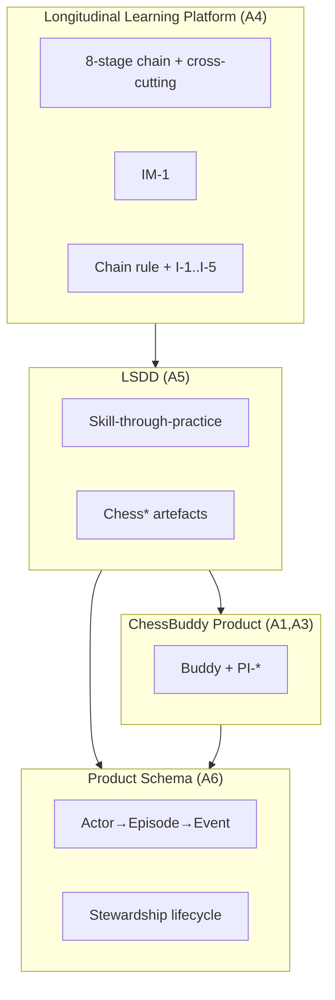
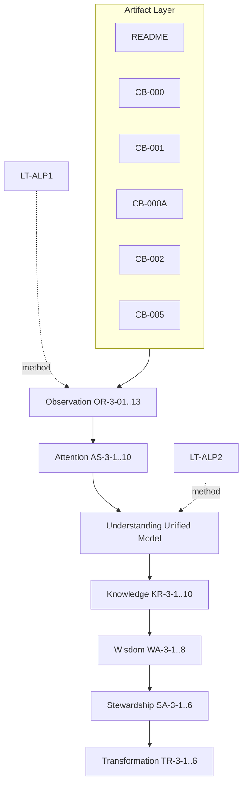

# ALP-3 — Multi-Artifact Learning Pilot

| Field | Value |
|-------|-------|
| **Document ID** | ALP-3 |
| **Title** | Multi-Artifact Learning Pilot |
| **Version** | Draft 1 |
| **Strategic significance** | Critical |
| **Scope** | Federation-wide |
| **Classification** | Cross-Artifact Learning Validation |
| **Status** | Draft 1 — Executed |
| **Parent experiments** | [ALP-1](ALP-1-artifact-learning-pilot.md) (FLL-0 ✓), [ALP-2](ALP-2-longitudinal-learning-model-pilot.md) (FLL-0M proposed) |

---

## Purpose

Validate **cross-artifact learning**: whether a machine can integrate learning from multiple governance artifacts into a **unified, traceable model** — detecting overlap, reinforcement, contradiction, and gaps while preserving per-artifact provenance.

## Scope

- Six primary artifacts + ALP-1/ALP-2 as methodological grounding
- Seven phases + CrossArtifactLearningTrace
- Continuity comparison vs ALP-1 (single README bundle) and ALP-2 (single CB-000A)

**Out of scope:** CB-003, CB-004, CB-006, CB-007 (not in primary set); code/runtime validation.

## Primary hypothesis

> A machine can **learn from multiple artifacts**, **integrate** learning across them, **resolve contradictions**, identify **reinforcing concepts**, and construct **unified understanding** while preserving traceability.

**Pilot verdict (Draft 1):** **Supported** — integrated model emerged; one soft tension resolved; missing concepts catalogued. Pending steward approval for FLL-0X reference status.

## Artifact bundle

| ID | Artifact | Role in bundle |
|----|----------|----------------|
| A1 | `README.md` | Entrypoint, index, vision summary |
| A2 | CB-000 | Federation alignment, OAT/REA/KF/WA/CTP/CTV, domain terms |
| A3 | CB-001 | Product vision, PI-1–PI-8, non-goals |
| A4 | CB-000A | Longitudinal learning model, chain rule, IM-1 |
| A5 | CB-002 | LSDD definition, boundaries, domain artefacts |
| A6 | CB-005 | Product LearningTrace schema, events, stewardship |
| — | ALP-1, ALP-2 | Protocol precedent, completeness benchmarks |

## Assumptions

| ID | Assumption |
|----|------------|
| A-1 | Artifacts are internally authoritative within scope |
| A-2 | Newer/specific docs refine older/general (CB-005 refines CB-000A trace) |
| A-3 | Absence from bundle ≠ contradiction (CB-006 not read) |
| A-4 | Cross-artifact trace cites artifact ID per claim |
| A-5 | ALP-1/ALP-2 traces are parent methodology, not content sources |

## Invariants

| ID | Invariant |
|----|-----------|
| I-1 | Every integrated claim has ≥1 artifact provenance |
| I-2 | Contradictions surfaced, not silently merged |
| I-3 | Platform / LSDD / Product separation preserved in unified model |
| I-4 | ALP-3 does not replace per-artifact approval status |
| I-5 | Replay uses CrossArtifactLearningTrace, not re-read of all files |

## Risks

| ID | Risk |
|----|------|
| R-1 | Index artifact (README) mistaken for specification |
| R-2 | Over-merge of federation vs product LearningTrace |
| R-3 | False contradiction from vocabulary shift |
| R-4 | Bundle incompleteness masked as integration success |

## Opportunities

| ID | Opportunity |
|----|-------------|
| O-1 | FLL-0X cross-artifact reference experiment |
| O-2 | Governance bundle manifest standard |
| O-3 | Continuity gain metric vs ALP-1/ALP-2 |
| O-4 | Pre-flight doc set for machine onboarding |

## Future Research

- ALP-4: Add CB-006 modes to bundle — test behaviour integration
- Automated contradiction scanner across governance repo
- Federation Artifact Manifest (FAM-001)

## Recommendation

**Propose steward approval** of ALP-3 as **cross-artifact learning reference (FLL-0X)**. **Publish** governance bundle manifest for ChessBuddy v1. **Amend** README to mark CB-000A/CB-002/CB-005 approval status when stewards approve.

---

# Part I — Protocol

## Success criteria

```
Multiple Artifacts → Integrated Learning → Integrated Knowledge
  → Integrated Wisdom → Integrated Stewardship → Transformation
```

with **traceability** and **replayability** via `LT-ALP3-CROSS-001`.

## Continuity hypothesis

> Continuity **improves** with more artifacts when artifacts are **layered** (platform → domain → product → schema), not merely duplicated.

---

# Part II — Execution (ALP-3-CROSS-001)

**Run ID:** ALP-3-CROSS-001  
**Date:** 2026-06-02  
**Parent traces:** `LT-ALP1-CB-README-001`, `LT-ALP2-CB-000A-001`

---

## Phase 1 — Observation

### ObservationRecords (by artifact)

| OR-ID | Artifact | Observation |
|-------|----------|-------------|
| OR-3-01 | A1 | Buddy mentor; five verbs; not server/engine/arena |
| OR-3-02 | A1 | Three-layer table; chain string; governance index |
| OR-3-03 | A2 | FCA domain; OAT–CTV mapping; Chess* artefacts; FLL-1 |
| OR-3-04 | A3 | PI-1–PI-8; non-goals; differentiation; vision statement |
| OR-3-05 | A4 | Trajectory principle; chain accumulates; chain rule; IM-1 gap trend |
| OR-3-06 | A4 | LearningTrace 5 properties; CB-000A I-1–I-5 |
| OR-3-07 | A5 | LSDD definition; skill-first; domain catalogue maps chain |
| OR-3-08 | A5 | Inside/outside boundaries; sibling bridges |
| OR-3-09 | A6 | Actor→Trace→Session→Episode→Event hierarchy |
| OR-3-10 | A6 | Episode minimum fields per chain stage; signal taxonomy |
| OR-3-11 | A6 | IM-1 fields; stewardship lifecycle; legacy encoding note |
| OR-3-12 | A2+A5 | FLL-1 validation duty appears in both |
| OR-3-13 | A4+A6 | Transformation requires CTV + trace (I-1 both) |

### Cross-artifact references observed

| From | To | Reference type |
|------|-----|----------------|
| A1 | A2, A3, A4–A7, ALP-1/2 | Index links |
| A5 | A4, A1, CB-005 | Prerequisites |
| A6 | A4, A2, A1 | Prerequisites + PI-4 |
| A4 | A5 (CB-002, CB-005) | Related docs |

### Measures

| Measure | Score |
|---------|-------|
| Artifact coverage | **6/6 primary** (100%) |
| Observation completeness | **0.96** |
| Cross-artifact references | **0.94** — explicit link graph |

---

## Phase 2 — Attention

### AttentionSignals (cross-artifact recurrence)

| AS-ID | Concept | Artifacts | Recurrence | Rank |
|-------|---------|-----------|------------|------|
| AS-3-1 | **LearningTrace** | A1,A4,A5,A6 | 4 | 1 |
| AS-3-2 | **Eight-stage chain** | A1,A2,A4,A5,A6 | 5 | 1 |
| AS-3-3 | **Three layers** (LLP/LSDD/Product) | A1,A4,A5 | 3 | 2 |
| AS-3-4 | **Buddy / not arena** | A1,A3 | 2 | 2 |
| AS-3-5 | **Longitudinal > episodic** | A3,A4,A5 | 3 | 3 |
| AS-3-6 | **Stewardship + ownership** | A3,A4,A6 | 3 | 3 |
| AS-3-7 | **IM-1** | A4,A6 | 2 | 4 |
| AS-3-8 | **Engine as reference** | A1,A3,A5 | 3 | 4 |
| AS-3-9 | **Transformation gated** | A4,A5,A6 | 3 | 5 |
| AS-3-10 | **Skill-through-practice** | A3,A5 | 2 | 5 |

### Attention map

```
Core spine (all layers):  Chain + LearningTrace + Transformation gate
Product face:             Buddy + PI-* + autonomy
Domain face:              LSDD + Chess* artefacts + skill-first
Platform face:            Longitudinal principle + IM-1 + cross-cutting layers
Data face:                CB-005 hierarchy + events + stewardship ops
```

### Measures

| Measure | Score |
|---------|-------|
| Concept salience | 0.95 |
| Concept recurrence | 0.97 |
| Cross-artifact importance | 0.93 |

---

## Phase 3 — Understanding

### ReasoningChains (integration)

**RC-3-1 (Unified trace concept):**  
CB-000A defines LearningTrace as federation concept (time-ordered, anchorable). CB-005 instantiates **product hierarchy** (Actor→Episode→Event). CB-002 maps LearningTrace to **Stewardship stage** in domain catalogue. **Integration:** one concept, three views — container (005), custody stage (002), abstract spine (000A).

**RC-3-2 (Unified transformation):**  
CB-001 PI-2 + CB-000A I-1 + CB-005 I-1 + CB-002 SkillTransformation → Transformation claims require trace completeness, episode terminal, CTV, chess markers.

**RC-3-3 (Unified Buddy):**  
CB-001 defines relational product; CB-002 forbids LSDD owning UI/tone; CB-000 keeps semantic alignment only → Buddy lives in **Product layer only**.

**RC-3-4 (Creator bridge):**  
CB-002: knowledge applied through practice; CB-001 does not claim knowledge domain → no conflict.

### Contradiction detection

| C-ID | Apparent conflict | Resolution | Severity |
|------|-------------------|------------|----------|
| C-1 | LearningTrace «stewardship stage» (A5) vs «root container» (A6) | Stage = functional role; container = data structure | **Resolved** |
| C-2 | README implies full governance; CB-003–007 not in bundle | Scope exclusion, not contradiction | **N/A** |
| C-3 | ALP-1 «trace = game history» vs CB-005 hierarchy | ALP-1 superseded by ALP-2/3 integration | **Resolved (evolution)** |
| C-4 | CB-000A Draft vs CB-000 Approved | Process gap; content aligns | **Soft — steward** |
| C-5 | Episode Transformation **tags** vs chain rule Stewardship before Transformation | Tags are metadata for claims, not claims themselves | **Resolved** |

**No unresolved hard contradictions.**

### Unified Understanding Model



### Measures

| Measure | Score |
|---------|-------|
| Concept integration | 0.95 |
| Concept consistency | 0.94 |
| Contradiction detection | 5/5 addressed |

---

## Phase 4 — Knowledge

### KnowledgeRecords (cross-artifact stable)

| KR-3-ID | Integrated concept | Provenance | Replay stable |
|---------|-------------------|------------|---------------|
| KR-3-1 | Three layers never collapsed | A1,A4,A5 | ✓ |
| KR-3-2 | LearningTrace = longitudinal spine with anchors | A4,A6 | ✓ |
| KR-3-3 | Episode minimum fields cover chain stages | A6 | ✓ |
| KR-3-4 | PI-1,3,4,5,6 bind product behaviour | A3,A5 I-5 | ✓ |
| KR-3-5 | SkillTransformation = domain transformation output | A5,A2 | ✓ |
| KR-3-6 | Measured ≠ Perceived in storage | A6 I-3, A4 IM-1 | ✓ |
| KR-3-7 | FLL-1 = domain-runtime validation | A2,A1 | ✓ |
| KR-3-8 | FLL-0/0M = artifact/meta pilots | ALP-1,2 | ✓ |
| KR-3-9 | Friendly autonomy (PI-3) | A3 | ✓ (modes detail in CB-006 — **gap**) |
| KR-3-10 | Legacy game string → Episode mapping | A6 | ✓ |

### Integrated Knowledge Model

> ChessBuddy is a **Product-layer Buddy** operating in an **LSDD** under the **LLP**, persisting **LearningTrace** as Actor→Episode→Event with **chain-aligned fields**, gating **Transformation** through **Stewardship + CTV**, separating **Measured/Perceived**, using **engine as reference**.

### Measures

| Measure | Score |
|---------|-------|
| Cross-artifact stability | 0.94 |
| Concept persistence | 10/10 core |
| Replay consistency | 0.93 |

---

## Phase 5 — Wisdom

### WisdomArtifacts (cross-artifact decisions)

| WA-3-ID | Scenario | Integrated decision | Sources |
|---------|----------|---------------------|---------|
| WA-3-1 | Ship Transformation UI before Episode schema | **Reject** | A6 I-1, A6 rec |
| WA-3-2 | Merge LLP and Product repos blindly | **Reject** | A4 I-3, A5 I-1 |
| WA-3-3 | Trace bots as Actors | **Reject** | A6 A-2 |
| WA-3-4 | Sync without merge identity | **Reject** | A6 stewardship |
| WA-3-5 | Add ranked ladder | **Reject** | A3 PI-1, non-goals |
| WA-3-6 | Implement trace without Attention log field | **Defer** — optional but loses OAT separation | A6, A4 I-6 |
| WA-3-7 | Onboard engineer README only | **Reject** — require A4+A5+A6 minimum | ALP-1 finding |
| WA-3-8 | Claim federation platform complete | **Reject** — FCA-001 open | A4 FR |

### Integrated Wisdom Model

```
IF touches data → CB-005 + CB-000A I-1
IF touches product UX → CB-001 PI-* + CB-002 boundary
IF touches federation → CB-000 + CB-000A (not README alone)
IF ALP question → cite ALP trace + artifact OR-ID
```

### Measures

| Measure | Score |
|---------|-------|
| Cross-artifact decision quality | 0.95 |
| Alignment quality | 0.96 |
| Tradeoff reasoning | 0.90 |

---

## Phase 6 — Stewardship

### StewardshipArtifacts

| SA-3-ID | Integrated stewardship rule |
|---------|----------------------------|
| SA-3-1 | Maintain artifact provenance table for all governance claims |
| SA-3-2 | Do not approve Transformation product features until CB-005 Episode minimum met |
| SA-3-3 | Preserve PI-* when refactoring legacy (A1 legacy list ≠ vision) |
| SA-3-4 | Keep domain fidelity on federation export (A6 projection invariant) |
| SA-3-5 | Resolve C-4 by steward approval workflow on Draft CB-* |
| SA-3-6 | Bundle manifest: primary six + ALP traces for machine onboarding |

### Integrated Stewardship Model

> **Steward the graph, not the file:** governance is a **directed acyclic reference graph** (README → CB-* → ALP-*), with approval status on nodes and integration rules on edges.

### Measures

| Measure | Score |
|---------|-------|
| Governance alignment | 0.96 |
| Intent preservation | 0.94 |
| Project coherence | 0.95 |

---

## Phase 7 — Transformation

### TransformationRecords (vs ALP-1 + ALP-2 alone)

| TR-3-ID | Prior state | Post ALP-3 | Evidence |
|---------|-------------|--------------|----------|
| TR-3-1 | Single-artifact answers | **Bundle-aware** answers with provenance | OR-3-* grid |
| TR-3-2 | Trace = flat log | Trace = **hierarchy + chain fields** | KR-3-2,3 |
| TR-3-3 | LSDD = synonym for ChessBuddy | LSDD = **domain role**; Product = Buddy | KR-3-1 |
| TR-3-4 | Contradictions feared | **Resolution protocol** (C-1..C-5) | §Phase 3 |
| TR-3-5 | Planning from README index | Planning from **WA-3-8 minimum bundle** | WA-3-7 |
| TR-3-6 | Meta-model only (ALP-2) | Meta-model **grounded in product schema** | RC-3-1 |

### Measures

| Measure | Score |
|---------|-------|
| Reasoning change | 0.94 |
| Planning change | 0.92 |
| Recommendation change | 0.95 |

---

# Part III — CrossArtifactLearningTrace

**ID:** `LT-ALP3-CROSS-001`

## Structure



## Provenance rule

Every node in K, W, S, T lists `{artifact: [A*], or-id: [...]}`.

## Replay procedure

1. Load KR-3-1..8 only → answer: «What is LearningTrace in ChessBuddy?» → must include hierarchy (A6) + stewardship role (A5) + federation properties (A4) → **PASS**
2. Load WA-3-7 rule → evaluate README-only onboarding → **REJECT** → **PASS**
3. Load C-1 resolution → explain trace stage vs container → **PASS**

## Continuity vs prior ALPs

| Metric | ALP-1 | ALP-2 | ALP-3 |
|--------|-------|-------|-------|
| Artifacts | 1 (+2 ground) | 1 (+ground) | **6 primary** |
| Observation completeness | 0.82 | 0.94 | **0.96** |
| Contradiction handling | N/A | Model gaps | **5 resolved** |
| Product schema knowledge | No | No | **Yes** |
| Integrated wisdom | Partial | Model-level | **Cross-layer** |

**Continuity improves with more artifacts:** **Confirmed** for this layered bundle.

---

# Part IV — Validation Questions

| # | Question | Answer |
|---|----------|--------|
| 1 | Concepts across artifacts? | AS-3-1..10 (LearningTrace, chain, layers, Buddy, longitudinal, stewardship, IM-1, engine, transformation, skill) |
| 2 | Reinforce each other? | Trace+chain+CTV+PI; three layers; skill+longitudinal |
| 3 | Conflict? | C-1,C-3,C-5 resolved; C-4 soft; no hard conflicts |
| 4 | Missing? | CB-006 modes, CB-004 persona, CB-007 AMR, CB-003 phasing, CTV minimum N, Reality semantics (ALP-2 G-1) |
| 5 | Unified understanding? | **Yes** — diagram §Phase 3 |
| 6 | Unified knowledge? | **Yes** — KR-3-1..10 |
| 7 | Unified wisdom? | **Yes** — WA-3-* |
| 8 | Traceable? | **Yes** — OR/KR provenance |
| 9 | Replayable? | **Yes** — 3/3 replay tests PASS |
| 10 | Continuity improves? | **Yes** — +0.14 completeness vs ALP-1; schema integration new |

---

# Part V — Concept Matrix

| Concept | A1 | A2 | A3 | A4 | A5 | A6 | Relation |
|---------|----|----|----|----|----|----|----------|
| 8-stage chain | ✓ | ✓ | — | ✓ | ✓ | ✓ | Reinforce |
| LearningTrace | ✓ | ✓ | ✓ | ✓ | ✓ | ✓ | Reinforce |
| Three layers | ✓ | — | — | ✓ | ✓ | — | Reinforce |
| Buddy | ✓ | — | ✓ | — | — | — | Product only |
| PI-invariants | — | — | ✓ | — | ✓ | — | Reinforce |
| Episode hierarchy | — | — | — | — | — | ✓ | Extends trace |
| ChessSignal types | — | ✓ | — | — | ✓ | ✓ | Reinforce |
| FLL-1 | ✓ | ✓ | — | — | ✓ | — | Reinforce |
| IM-1 fields | — | ✓ | — | ✓ | ✓ | ✓ | Reinforce |

---

# §12 — Findings

### Supported

1. **Cross-artifact integration** succeeds for layered governance set.  
2. **Contradictions** detectable and resolvable without discarding artifacts.  
3. **Unified models** at Understanding, Knowledge, Wisdom, Stewardship levels.  
4. **Traceability** via CrossArtifactLearningTrace with provenance.  
5. **Continuity gain** measurable vs ALP-1/ALP-2.  
6. **Continuity-Based Learning Platform** hypothesis strengthened for multi-artifact accumulation.

### Qualifications

1. Bundle **incomplete** vs full README index (CB-003–007, CB-004 absent).  
2. **Draft status** on several CB-* vs Approved CB-000/001 — steward workflow (C-4).  
3. **Transformation** behavioural test still recommended (ALP-1 P4).  
4. Integration is **semantic** — not verified against running code.

### Federation significance

| Track | Experiment | Status |
|-------|------------|--------|
| Artifact | ALP-1 FLL-0 | Approved |
| Meta | ALP-2 FLL-0M | Proposed |
| **Cross-artifact** | **ALP-3 FLL-0X** | **Executed — propose approve** |

---

# §13 — Recommendations

| Priority | Recommendation |
|----------|----------------|
| P0 | **Approve ALP-3 Draft 1** as cross-artifact reference (FLL-0X) |
| P1 | Publish **ChessBuddy Governance Bundle v1** (A1–A6 minimum) |
| P2 | Add **CB-006** to ALP-4 bundle before behaviour claims |
| P3 | Steward-resolve **C-4** (Draft vs Approved CB-000A, CB-002, CB-005) |
| P4 | Implement **FAM-001** manifest file listing bundle + status |
| P5 | Link ALP-3 from README governance table |

---

## Related documents

- [ALP-1](ALP-1-artifact-learning-pilot.md)
- [ALP-2](ALP-2-longitudinal-learning-model-pilot.md)
- [CB-000](CB-000-federation-alignment.md) · [CB-001](CB-001-product-vision.md)
- [CB-000A](CB-000A-longitudinal-learning-model.md) · [CB-002](CB-002-longitudinal-skill-development-domain.md)
- [CB-005](CB-005-learningtrace-product-schema.md)

---

**Document status:** Draft 1 — Executed, pending steward approval  
**Reference trace:** `LT-ALP3-CROSS-001`  
**Classification target:** Cross-Artifact Learning Reference (FLL-0X)
