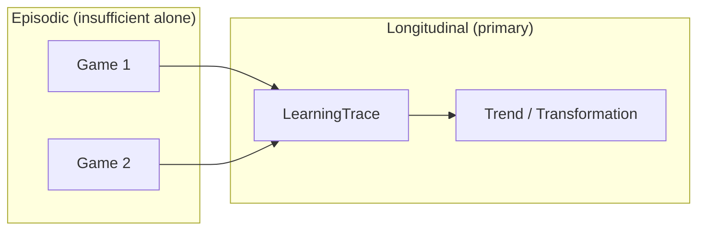

# CB-000A — Longitudinal Learning Model

| Field | Value |
|-------|-------|
| **Document ID** | CB-000A |
| **Title** | Longitudinal Learning Model |
| **Version** | Draft 1 |
| **Strategic significance** | High |
| **Scope** | Federation architecture (ChessBuddy-informed) |
| **Status** | Draft |
| **Prerequisites** | [CB-000](CB-000-federation-alignment.md), [CB-001](CB-001-product-vision.md) |

---

## Purpose

Define the **Longitudinal Learning Model** used by the Federated Continuity Architecture and instantiated by ChessBuddy. Clarify how learning progresses along time, how each stage of the federation learning chain operates longitudinally, and how three federation layers relate:

| Layer | Definition |
|-------|------------|
| **Longitudinal Learning Platform** | Federation-wide architecture for learning over time |
| **Longitudinal Skill Development Domain** | ChessBuddy's federation domain (see CB-002) |
| **ChessBuddy Product** | User-facing mentor (see CB-001) |

This document does **not** define product features or implementation.

## Scope

- Longitudinal vs episodic learning
- Learning chain as a time-extended process
- Role of trace, validation, introspection, and transformation
- Generic model applicable across federation domains; chess used only as illustration

**Out of scope:** ChessBuddy UI, technology, delivery phases (CB-003).

## The longitudinal principle

> **Learning is not an event. Learning is a trajectory.**

A single game, lesson, or observation is a **data point**. Longitudinal learning treats a **series** of data points as the primary unit of analysis, memory, and validation.

## Federation learning chain (longitudinal view)

Each stage produces **artefacts that accumulate and constrain** later stages:

| Stage | Longitudinal function | Accumulates |
|-------|----------------------|-------------|
| **Reality** | What actually occurred in the domain | Raw events |
| **Observation** | What was registered | ChessObservation / domain equivalent |
| **Attention** | What was highlighted for the learner | Attention history |
| **Understanding** | What was interpreted | Reasoning artefacts |
| **Knowledge** | What was consolidated | Stable knowledge |
| **Wisdom** | What guided action | Normative guidance history |
| **Stewardship** | What was preserved responsibly | LearningTrace custody |
| **Transformation** | What changed in capability | SkillTransformation |

**Chain rule (longitudinal):** Transformation claims require traceable lineage through Stewardship back to Observation.

## Cross-cutting layers (longitudinal role)

| Layer | Longitudinal role |
|-------|-------------------|
| **OAT** | Produces time-stamped observation stream; attention filters evolve with learner state |
| **REA** | Reasoning quality judged across sequences, not single positions |
| **KF** | Knowledge consolidates from repeated patterns in the trace |
| **WA** | Wisdom adapts guidance based on trace diagnosis |
| **CTP** | Enables full reconstruction of the learning path |
| **CTV** | Validates trends, consistency, and IM-1 gaps over N episodes |

## IM-1 in the longitudinal model

**IM-1 (Introspection Mapping)** compares **Measured State** (registered, objective proxies) with **Perceived State** (learner belief or behavioural inference) at each stage.

Longitudinal IM-1 asks: *Does the divergence gap narrow over time?* A shrinking gap may indicate genuine transformation; a persistent gap may indicate false confidence or unaddressed blind spots.

## LearningTrace (federation concept)

> A **LearningTrace** is a time-ordered, anchorable record of learning-bearing artefacts for one actor across one or more sessions.

Properties required by the model:

| Property | Requirement |
|----------|-------------|
| **Temporal ordering** | Events have sequence |
| **Anchorability** | Stable reference points for reasoning and CTP |
| **Domain fidelity** | Semantics preserved in domain layer |
| **Projectability** | Can project to federation Generic Trace Core (future) |
| **Stewardship** | Actor ownership and lifecycle rules |

ChessBuddy product schema: [CB-005](CB-005-learningtrace-product-schema.md).

## Assumptions

| ID | Assumption |
|----|------------|
| A-1 | Meaningful learning in skill domains requires multiple episodes |
| A-2 | Measured proxies exist or can be constructed for skill domains |
| A-3 | Perceived state is always incomplete; IM-1 is necessary |
| A-4 | Domains can map to the same chain without semantic collapse |
| A-5 | ChessBuddy is a valid first empirical instance of this model |

## Invariants

| ID | Invariant |
|----|-----------|
| I-1 | No Transformation claim without LearningTrace + CTV |
| I-2 | Stewardship sits between Knowledge/Wisdom and Transformation |
| I-3 | Longitudinal Learning Platform ≠ any single domain |
| I-4 | Episodic success does not imply longitudinal transformation |
| I-5 | Time is a first-class dimension in all federation learning analysis |

## Risks

| ID | Risk | Mitigation |
|----|------|------------|
| R-1 | Platform model too abstract for products | CB-002, CB-005 ground chess instance |
| R-2 | Trace volume overwhelms users | Proportionality (CB-004), modes (CB-006) |
| R-3 | False transformation from noise | CTV minimum N and trend rules |
| R-4 | Domains forced into chess-shaped traces | Domain layer + projectability only at federation boundary |

## Opportunities

- Unified vocabulary for Creator, BioChronos, Finkairos, Domosofi, Laris, ChessBuddy
- FLL-1 empirical validation via ChessBuddy
- IM-1 as federation-wide introspection protocol

## Future Research

- Minimum episode count for CTV confidence per domain type
- Generic Trace Core formal specification (FCA-001)
- Cross-domain LearningTrace correlation (e.g. BioChronos tempo → ChessBuddy performance)

## Recommendation

**Approve** CB-000A as the federation longitudinal learning reference model. Require CB-002, CB-005, and CB-006 to declare compliance with I-1–I-5.

## Related documents

- [CB-000](CB-000-federation-alignment.md)
- [CB-001](CB-001-product-vision.md)
- [CB-002](CB-002-longitudinal-skill-development-domain.md)
- [CB-005](CB-005-learningtrace-product-schema.md)
