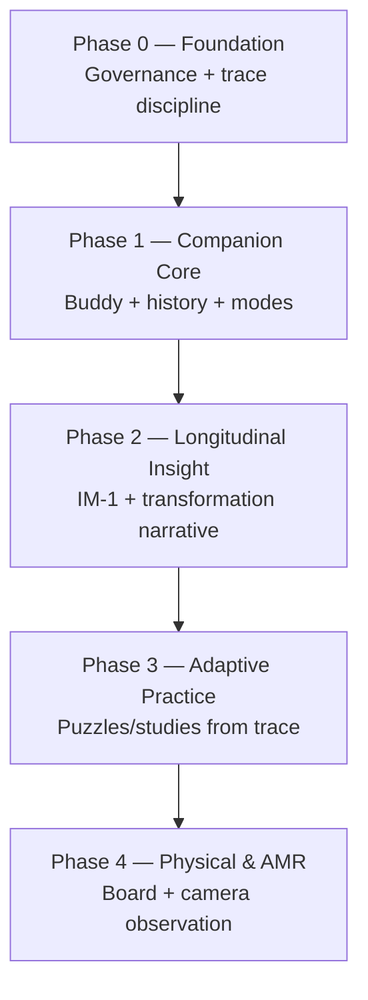

# CB-003 — Roadmap & Delivery Strategy

| Field | Value |
|-------|-------|
| **Document ID** | CB-003 |
| **Title** | Roadmap & Delivery Strategy |
| **Version** | Draft 1 |
| **Strategic significance** | High |
| **Scope** | Product delivery (governance) |
| **Status** | Draft |
| **Prerequisites** | [CB-000](CB-000-federation-alignment.md), [CB-001](CB-001-product-vision.md), [CB-002](CB-002-longitudinal-skill-development-domain.md) |

---

## Purpose

Define how ChessBuddy evolves from its **legacy codebase** toward the **CB-001 vision** in phases — without prescribing technology choices. Establish delivery principles, horizons, dependencies between governance artefacts, and federation validation milestones.

## Scope

- Strategic horizons (H1–H4 aligned with CB-001)
- Capability phases and governance dependencies
- Delivery principles and quality gates
- What is deferred vs prioritised

**Out of scope:** Stack selection, sprint plans, repository structure, CI/CD design.

## Delivery north star

Deliver **longitudinal skill development** visible to the user through a **Buddy** that remembers, explains, and validates — not a feature checklist of chess utilities.

## Horizons

| Horizon | Time | Outcome | Federation role |
|---------|------|---------|-----------------|
| **H1** | 0–2 years | Trustworthy LearningTrace; core Buddy modes; physical-friendly play | FLL-1 pilot data |
| **H2** | 2–5 years | Adaptive practice from trace; IM-1 visibility; AMR pilot | Trace schema reference |
| **H3** | 5–10 years | Mature LSDD; trainer/club stewardship; Creator bridges | Inter-domain learning |
| **H4** | 10+ years | LSDD pattern export to other skill domains | Federation template |

## Phased capability roadmap

### Phase 0 — Foundation (current adoption)

| Deliverable | Governance basis |
|-------------|------------------|
| Approved vision and federation alignment | CB-000, CB-001 |
| Longitudinal model and LSDD definition | CB-000A, CB-002 |
| LearningTrace product schema | CB-005 |
| Persona and modes | CB-004, CB-006 |

**Exit criteria:** All Phase 1 work traces to PI-1–PI-8; no feature without mode and trace impact assessment.

### Phase 1 — Companion Core

| Capability | User-visible value |
|------------|-------------------|
| Consistent Buddy presence | Mentor, not tool dump |
| Game history as LearningTrace | Remembers journey |
| Opening + engine attention (refined) | Observation without overload |
| User modes (friendly, training) | CB-006 |
| Stewardship basics | Export, ownership clarity |

**Maps from legacy:** analysis, opening marks, clock info, engine hints, history — **reframed** under CB-001, not merely preserved.

**Exit criteria:** LearningTrace schema populated for every completed game; CB-005 compliance.

### Phase 2 — Longitudinal Insight

| Capability | User-visible value |
|------------|-------------------|
| Transformation narrative | «You are improving in X» with evidence |
| IM-1 surfacing | Measured vs perceived gaps |
| Focus contracts | One improvement theme at a time |
| CTV-gated claims | No false progress |

**Exit criteria:** FLL-1 can reconstruct chain for sample users; IM-1 documented per session type.

### Phase 3 — Adaptive Practice

| Capability | User-visible value |
|------------|-------------------|
| Puzzles from own mistakes | Personal training |
| Study suggestions from trace | Guided depth |
| Post-game reflection flows | Explanation hierarchy (CB-004) |

**Exit criteria:** Practice linked to ChessAnchor in trace; transformation metric defined.

### Phase 4 — Physical & AMR

| Capability | User-visible value |
|------------|-------------------|
| Physical board-first UX | CB-007 |
| Camera observation (opt-in) | Reduced friction |
| Clock integration | Temporal learning signals |

**Exit criteria:** AMR accuracy and privacy requirements met (CB-007); manual path remains valid.

## Delivery principles

| Principle | Rule |
|-----------|------|
| **Vision-first** | CB-001 wins over legacy behaviour |
| **Trace-first** | If it isn't in LearningTrace, it didn't happen for learning |
| **Mode-aware** | CB-006 defines behaviour per context |
| **Governance before code** | Update docs when product truth changes |
| **Incremental rewrite** | Phases may replace implementation; invariants hold |
| **Federation honesty** | Report FLL-1 limits — chess skill ≠ all learning |

## Quality gates (non-technical)

| Gate | Question |
|------|----------|
| G-1 | Does this feature strengthen Buddy relationship? |
| G-2 | Does it respect active user mode? |
| G-3 | Does it write/read LearningTrace correctly? |
| G-4 | Does it avoid non-goals (CB-001)? |
| G-5 | Is Transformation claim CTV-backed? |

## Assumptions

| ID | Assumption |
|----|------------|
| A-1 | Legacy app remains deployable during Phase 1 |
| A-2 | Team capacity favours depth over breadth early |
| A-3 | Federation Generic Trace Core may lag ChessBuddy schema |
| A-4 | AMR remains Phase 4 — not blocking Phases 1–2 |

## Invariants

| ID | Invariant |
|----|-----------|
| I-1 | Roadmap phases do not skip Stewardship before Transformation claims |
| I-2 | CB-001 PI-* unchanged across phases |
| I-3 | Technology may change; product invariants may not |
| I-4 | Each phase produces FLL-1 learnings documented for federation |

## Risks

| ID | Risk | Mitigation |
|----|------|------------|
| R-1 | Legacy features anchor roadmap | Phase 1 reframing review |
| R-2 | AMR promised too early | Phase 4 lock |
| R-3 | Platform scope creep in H2 | CB-000A boundary |
| R-4 | Documentation drift from product | Governance commits per artefact |

## Opportunities

- H1 delivers differentiated product without AMR
- FLL-1 reports after Phase 2 attract federation investment
- Phase 3 adaptive puzzles = strong moat vs Lichess random puzzles

## Future Research

- Commercial model per phase (out of CB-003 scope)
- Technical architecture document series (post-governance)
- Club/trainer B2B2C in H3

## Recommendation

**Approve** phased delivery P0→P4. **Prioritise** Phase 0 completion (governance) and Phase 1 LearningTrace + modes before new AMR investment. **Defer** platform-wide abstractions until CB-005 is stable in product.

## Related documents

- [CB-001](CB-001-product-vision.md)
- [CB-004](CB-004-buddy-persona-and-product-principles.md)
- [CB-005](CB-005-learningtrace-product-schema.md)
- [CB-006](CB-006-user-modes.md)
- [CB-007](CB-007-physical-chess-and-amr-product-requirements.md)
