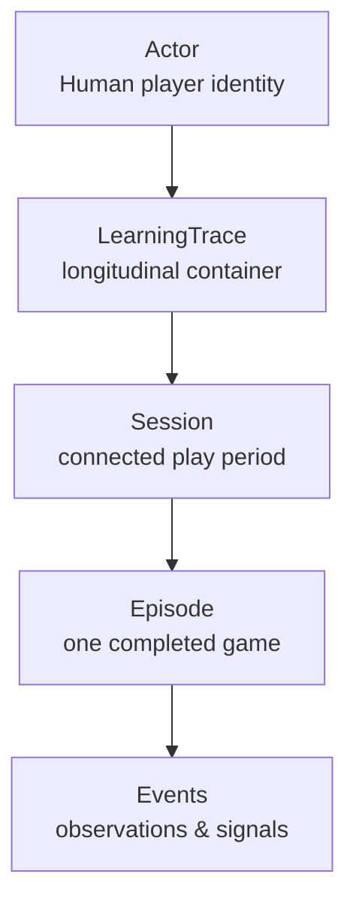

# CB-005 — LearningTrace Product Schema

| Field | Value |
|-------|-------|
| **Document ID** | CB-005 |
| **Title** | LearningTrace Product Schema |
| **Version** | Draft 1 |
| **Strategic significance** | High |
| **Scope** | Product data architecture (semantic) |
| **Status** | Draft |
| **Prerequisites** | [CB-000](CB-000-federation-alignment.md), [CB-000A](CB-000A-longitudinal-learning-model.md), [CB-002](CB-002-longitudinal-skill-development-domain.md) |

---

## Purpose

Define the **product-level schema** for LearningTrace in ChessBuddy: what is recorded, how episodes compose a trace, anchor rules, stewardship lifecycle, and federation projectability — **without** database tables, file formats, or API payloads.

## Scope

- Trace hierarchy: Actor → Session → Episode → Event
- Semantic fields and required artefacts
- Anchor and signal taxonomy
- Stewardship operations
- Mapping to federation learning chain

**Out of scope:** SQL, JSON Schema files, localStorage keys, sync protocol.

## Trace hierarchy

| Level | Definition |
|-------|------------|
| **Actor** | The learner whose skill is traced (may have email/device for stewardship) |
| **LearningTrace** | All sessions and episodes for one Actor in ChessBuddy LSDD |
| **Session** | A calendar-bounded or explicitly started play period (optional grouping) |
| **Episode** | One completed game (win/loss/draw/abandoned with rules) |
| **Event** | Atomic ChessObservation or ChessSignal |

## Episode semantic record (minimum)

Each **Episode** must support reconstruction of:

| Field group | Semantic content | Chain stage |
|-------------|-------------------|-------------|
| **Identity** | Episode ID, Actor, start/end time | Stewardship |
| **Participants** | White, Black (Human/Bot reference) | Reality |
| **Observation stream** | Move sequence, times per side, terminal result | Observation |
| **Attention log** | When hints/openings/CP were shown (optional) | Attention |
| **Understanding** | Key ChessReasoning summaries (post-hoc or inline) | Understanding |
| **Knowledge refs** | Opening IDs matched from tree | Knowledge |
| **Wisdom refs** | Engine suggestion vs chosen move deltas | Wisdom |
| **Anchors** | ChessAnchor list | CTP |
| **Transformation tags** | Focus area, milestone flags | Transformation |

## Event types (ChessSignal taxonomy)

| Signal type | Learning bearing |
|-------------|------------------|
| `move.played` | Player or bot move applied |
| `move.attempted_illegal` | Observation of rule gap |
| `move.deviation_from_reference` | Measured gap vs engine PV |
| `opening.recognized` | Attention/knowledge trigger |
| `time.milestone` | Clock threshold crossed |
| `game.terminal` | Result or mate recorded |
| `hint.shown` / `hint.dismissed` | Attention stewardship |
| `reflection.recorded` | Post-game learner note (Perceived State) |

## ChessAnchor rules

| Rule ID | Rule |
|---------|------|
| AN-1 | Every Episode has ≥1 anchor (e.g. first move or game ID) |
| AN-2 | Anchors are immutable once written |
| AN-3 | Anchor types: `move`, `opening`, `position_class`, `focus_contract` |
| AN-4 | Cross-episode anchors enable pattern queries («this pawn structure») |

## IM-1 fields (product semantic)

Per Episode or sub-episode, trace may hold:

| Field | Type | Description |
|-------|------|-------------|
| `measured.eval_peak` | Measured | Engine CP extrema |
| `measured.blunder_count` | Measured | Deviations above threshold |
| `perceived.confidence` | Perceived | Optional user-reported 1–5 |
| `perceived.focus` | Perceived | Active focus contract ID |
| `im1.gap_score` | Derived | Normalised divergence metric |

## Stewardship lifecycle

| Operation | Actor right | Buddy behaviour |
|-----------|-------------|-----------------|
| **Create** | Implicit on play | Append to trace |
| **Read** | Full | Recall with proportionality |
| **Export** | Full | Provide portable bundle (format TBD in tech doc) |
| **Delete episode** | Full | Remove anchors; no ghost references |
| **Sync** | Opt-in | Merge by episode identity; no silent overwrite |
| **Share** | Opt-in explicit | No default public feed |

Aligns with CB-001 PI-4 and Domosofi stewardship bridge (CB-002).

## Federation projectability

Domain layer (chess-rich) projects to federation Generic Trace Core (future) via:

| Domain field | Federation projection |
|--------------|----------------------|
| Episode timeline | `trace.temporal` |
| Anchors | `trace.anchors` |
| Signals | `trace.events` |
| SkillTransformation | `trace.outcome.skill_delta` |

**Invariant:** Projection is lossy at federation boundary only — never in product storage.

## Legacy alignment note

Existing serialised game strings (semicolon-separated) are a **legacy Episode encoding**. Phase 1 (CB-003) requires mapping into this schema semantically — not necessarily immediate format change.

## Assumptions

| ID | Assumption |
|----|------------|
| A-1 | One primary Actor per device default; multi-human later |
| A-2 | Bot opponents are not skill-traced as LSDD actors |
| A-3 | Not every Event requires real-time persistence in H1 |
| A-4 | Federation Generic Trace Core will follow ChessBuddy pilot |

## Invariants

| ID | Invariant |
|----|-----------|
| I-1 | No Transformation tag without Episode terminal + CTV |
| I-2 | Deletes are actor-initiated; Buddy cannot hide episodes |
| I-3 | Measured and Perceived fields never conflated in storage semantics |
| I-4 | Trace complies with CB-000A I-1–I-5 |

## Risks

| ID | Risk |
|----|------|
| R-1 | Schema too heavy for casual users |
| R-2 | Legacy format blocks migration |
| R-3 | Sync conflicts corrupt trace |
| R-4 | Over-collection without stewardship consent |

## Opportunities

- Foundation for adaptive puzzles (CB-003 Phase 3)
- FLL-1 export package for federation
- Trainer read-only trace views (H3)

## Future Research

- Technical schema (CB-T005, future)
- Cross-device Actor merge rules
- Federation FCA-001 alignment audit

## Recommendation

**Approve** CB-005 as the semantic contract for all learning-bearing product data. **Block** Transformation UX until Episode minimum fields are populated.

## Related documents

- [CB-000A](CB-000A-longitudinal-learning-model.md)
- [CB-002](CB-002-longitudinal-skill-development-domain.md)
- [CB-003](CB-003-roadmap-and-delivery-strategy.md)
- [CB-006](CB-006-user-modes.md)
