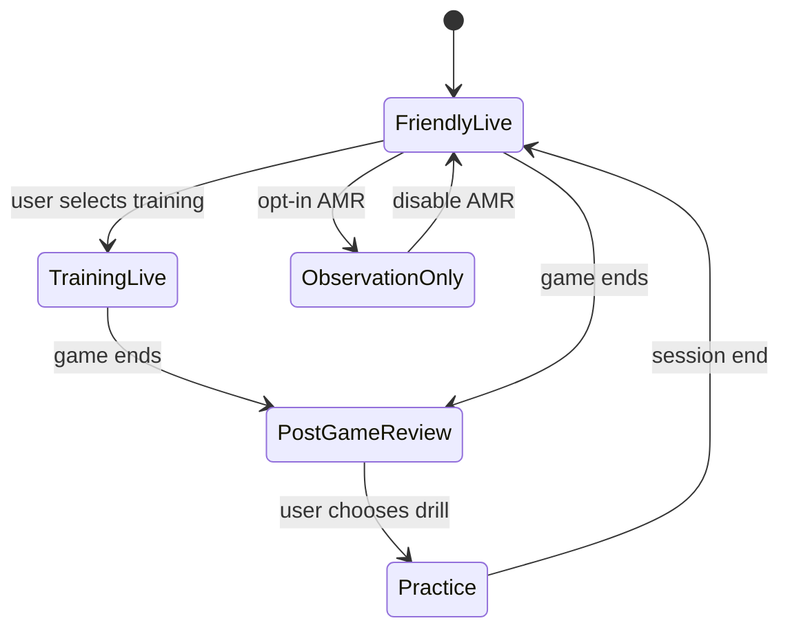

# CB-006 — User Modes

| Field | Value |
|-------|-------|
| **Document ID** | CB-006 |
| **Title** | User Modes |
| **Version** | Draft 1 |
| **Strategic significance** | High |
| **Scope** | Product behaviour |
| **Status** | Draft |
| **Prerequisites** | [CB-001](CB-001-product-vision.md), [CB-004](CB-004-buddy-persona-and-product-principles.md), [CB-005](CB-005-learningtrace-product-schema.md) |

---

## Purpose

Define **User Modes** that govern Buddy intervention level, attention policies, trace capture depth, and autonomy — so one product serves friendly over-the-board play, deliberate training, post-game learning, and practice without mode conflict.

## Scope

- Mode catalogue and transitions
- Per-mode rules for Buddy, OAT, engines, clocks
- LearningTrace capture differences
- Mode invariants vs CB-001 PI-3

**Out of scope:** UI layout, settings storage, mode icons.

## Mode catalogue

| Mode | Primary context | PI-3 autonomy |
|------|-----------------|---------------|
| **Friendly Live** | Two humans, physical or screen; social play | **Maximum** — minimal coaching |
| **Training Live** | Human vs bot or coached sparring | **High** — help on request |
| **Post-Game Review** | After terminal position | **N/A** — reflective |
| **Practice** | Puzzles / studies from trace | **Full** — exercise framing |
| **Observation Only** | Kamera/AMR logging without coaching | **Maximum** — silent capture |

## Mode behaviour matrix

| Behaviour | Friendly Live | Training Live | Post-Game | Practice | Observation Only |
|-----------|---------------|---------------|-----------|----------|------------------|
| Opening markers | Subtle | On | Full | Contextual | Log only |
| Engine hints on board | Off/default off | On request | Analysis | N/A | Off |
| CP display | Optional quiet | On | On | Optional | Off |
| Buddy voice | Rare | Moderate | Full | Teaching | None |
| Move for player | **Never** | Bot only | N/A | N/A | Never |
| LearningTrace events | Core moves + time | + hints + deviations | + reflection | + exercise results | Full observation stream |
| IM-1 prompts | Off | Optional | On | On | Off |

## Mode definitions

### Friendly Live

> **Purpose:** Companion respect for social chess; learning is secondary and opt-in.

- Buddy defaults to **silent presence**
- Clock is informational only (CB-001)
- Trace captures Episode for longitudinal memory without interrupting flow
- Any hint requires explicit user action

### Training Live

> **Purpose:** Skill development during play with controlled support.

- Human vs Bot or coached human
- Hints and CP available per user setting within proportionality (CB-004)
- `move.deviation_from_reference` signals recorded for later Practice
- Buddy explains on request, not every move

### Post-Game Review

> **Purpose:** Understanding and IM-1 after Reality is fixed.

- Full explanation hierarchy permitted (CB-004)
- No move input unless entering separate line exploration (does not alter Episode)
- `reflection.recorded` encouraged for Perceived State
- Transformation claims only with CTV across traces

### Practice

> **Purpose:** Adaptive repetition from player's own trace.

- Puzzles/studies anchored to ChessAnchor in prior Episodes
- Buddy teaching intent dominant (PP-3)
- Episodes may be synthetic (exercise ID) — tagged separately in trace

### Observation Only

> **Purpose:** Physical board capture without coaching — AMR and camera path (CB-007).

- Record ChessObservation stream; no Attention overlays
- User must understand mode before camera activation
- Exit to Friendly or Training for coached play

## Mode transitions

| Rule | Description |
|------|-------------|
| TR-1 | Mode must be visible to user at all times |
| TR-2 | Post-Game cannot mutate completed Episode moves |
| TR-3 | Switching to Training mid-game requires explicit consent |
| TR-4 | Observation Only requires privacy acknowledgement |

## Assumptions

| ID | Assumption |
|----|------------|
| A-1 | Users can identify their social vs training intent |
| A-2 | Default mode for new users is Friendly Live |
| A-3 | One active mode per Episode at a time |

## Invariants

| ID | Invariant |
|----|-----------|
| I-1 | Friendly Live never auto-plays or auto-hints (PI-3) |
| I-2 | Mode determines trace Event types collected (CB-005) |
| I-3 | Buddy persona (CB-004) applies in all modes — tone scales |
| I-4 | Observation Only never surfaces engine overlays without mode change |

## Risks

| ID | Risk | Mitigation |
|----|------|------------|
| R-1 | Users stuck in wrong mode | TR-1 visibility |
| R-2 | Training behaviour leaks into friendly | I-1 enforcement |
| R-3 | Trace inconsistency across modes | Event type tagging |
| R-4 | AMR without Observation Only clarity | CB-007 linkage |

## Opportunities

- Single app serves clock-side friendly play and deep training
- Clear product story vs «always coaching» apps
- Mode-aware FLL-1 experiments (IM-1 in Post-Game only)

## Future Research

- Per-opponent mode memory (always friendly vs John trains)
- Club/tournament mode (spectator trace)
- Child account restricted modes

## Recommendation

**Approve** five-mode model. **Implement** Friendly Live and Training Live first (CB-003 Phase 1); Post-Game and Practice in Phase 2–3; Observation Only with CB-007 Phase 4.

## Related documents

- [CB-001](CB-001-product-vision.md)
- [CB-004](CB-004-buddy-persona-and-product-principles.md)
- [CB-005](CB-005-learningtrace-product-schema.md)
- [CB-007](CB-007-physical-chess-and-amr-product-requirements.md)
