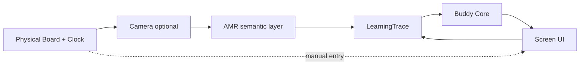

# CB-007 — Physical Chess & AMR Product Requirements

| Field | Value |
|-------|-------|
| **Document ID** | CB-007 |
| **Title** | Physical Chess & AMR Product Requirements |
| **Version** | Draft 1 |
| **Strategic significance** | High |
| **Scope** | Product requirements (physical play) |
| **Status** | Draft |
| **Prerequisites** | [CB-001](CB-001-product-vision.md), [CB-005](CB-005-learningtrace-product-schema.md), [CB-006](CB-006-user-modes.md) |

---

## Purpose

Define product requirements for **physical chess integration** and **Automatic Move Recognition (AMR)** via camera observation — preserving CB-001 PI-7 (physical first-class), PI-3 (autonomy), and PI-4 (stewardship), without selecting computer vision stacks or hardware.

## Scope

- Physical board and clock roles
- Camera-based observation requirements
- AMR accuracy, failure, and confirmation flows
- Privacy and consent
- Integration with LearningTrace and User Modes

**Out of scope:** ML models, frame rates, device SDKs, 3D board detection algorithms.

## Strategic intent

ChessBuddy must excel when **the board is real and the screen is beside it** — mentor at the edge, not replacement at the centre.

## Physical board requirements

| ID | Requirement |
|----|-------------|
| PB-1 | UI supports **board rotation** for chess-clock orientation (90° sideways) — informational companion layout |
| PB-2 | Screen readable at arm's length from physical board |
| PB-3 | Touch/drag input remains valid when screen is primary input |
| PB-4 | Physical setup does not require network connectivity for core play |
| PB-5 | Buddy interventions in Friendly Live remain non-intrusive (CB-006) |

## Clock requirements

| ID | Requirement |
|----|-------------|
| CLK-1 | Display white/black time as **informational** — no forced flag-fall |
| CLK-2 | Record time per side into Episode trace (CB-005) |
| CLK-3 | Future: optional integration with external digital clocks (semantic event import) |
| CLK-4 | Time signals may feed longitudinal tempo analysis (BioChronos bridge) |

## Camera observation requirements

| ID | Requirement |
|----|-------------|
| CAM-1 | Camera use is **opt-in** per session with clear indicator |
| CAM-2 | User can end observation instantly; recording stops |
| CAM-3 | Prefer on-device processing where feasible (stewardship) |
| CAM-4 | No cloud upload of video without explicit separate consent |
| CAM-5 | Default pairing with **Observation Only** or explicit Training consent (CB-006) |

## AMR requirements

### Functional

| ID | Requirement |
|----|-------------|
| AMR-1 | Detect legal move sequences from standard starting position on standard 8×8 board |
| AMR-2 | Emit `move.played` ChessSignals into LearningTrace |
| AMR-3 | Detect terminal state (checkmate, stalemate, draw claims manual) |
| AMR-4 | Support promotion ambiguity resolution via user confirmation |
| AMR-5 | Manual move entry always available as equal citizen |

### Accuracy & failure

| ID | Requirement |
|----|-------------|
| AMR-6 | On low confidence, Buddy requests confirmation — never silent wrong move |
| AMR-7 | User can correct last observation; correction is trace Event |
| AMR-8 | Product defines minimum accuracy target for «GA» label (future tech doc) — until met, AMR is beta |
| AMR-9 | Repeated failures offer fallback to manual without shame messaging (CB-004) |

### Pedagogical

| ID | Requirement |
|----|-------------|
| AMR-10 | AMR reduces friction, not surveillance — no «watching you» framing |
| AMR-11 | AMR does not auto-trigger engine hints in Friendly Live |
| AMR-12 | AMR observations are Measured State; Perceived State still user-owned |

## System context diagram

## Engines in physical context

| Rule | Description |
|------|-------------|
| ENG-1 | Engine runs as reference, not as move source for humans |
| ENG-2 | Engine analysis overlays disabled in Observation Only |
| ENG-3 | Post-game engine depth may exceed live depth — mode dependent |

## Assumptions

| ID | Assumption |
|----|------------|
| A-1 | Standard tournament-size boards dominate user base |
| A-2 | Lighting and angle vary — AMR must be robust or honest about limits |
| A-3 | Many users will never enable camera — product must be complete without it |
| A-4 | Phase 4 delivery (CB-003) — not blocking earlier phases |

## Invariants

| ID | Invariant |
|----|-----------|
| I-1 | Manual path never removed (PI-7, AMR-5) |
| I-2 | Camera off means no observation Events (CAM-2) |
| I-3 | AMR never violates Friendly Live autonomy (CB-006 I-1) |
| I-4 | All AMR Events map to CB-005 signal taxonomy |

## Risks

| ID | Risk | Mitigation |
|----|------|------------|
| R-1 | Privacy backlash | CAM-1–4, on-device preference |
| R-2 | AMR errors destroy trust | AMR-6–7, beta labelling |
| R-3 | Physical feature delays core trace | CB-003 phase gating |
| R-4 | Surveillance perception in schools | Observation Only + stewardship copy |

## Opportunities

| ID | Opportunity |
|----|-------------|
| O-1 | Clear market gap vs online-only platforms |
| O-2 | Club «board + Buddy» station |
| O-3 | Richest ChessObservation stream for FLL-1 |
| O-4 | Hands-free friendly game logging |

## Future Research

- Piece recognition on unusual sets / colours
- Multi-board venue mode
- Integration with DGT/e-board exports
- AR overlay (non-AMR) evaluation

## Recommendation

**Approve** CB-007 as product requirements baseline. **Do not** market AMR as core until AMR-8 satisfied. **Ship** PB-1–PB-5 and CLK-1–2 in Phase 1; CAM/AMR in Phase 4 per CB-003.

## Related documents

- [CB-001](CB-001-product-vision.md)
- [CB-003](CB-003-roadmap-and-delivery-strategy.md)
- [CB-005](CB-005-learningtrace-product-schema.md)
- [CB-006](CB-006-user-modes.md)
